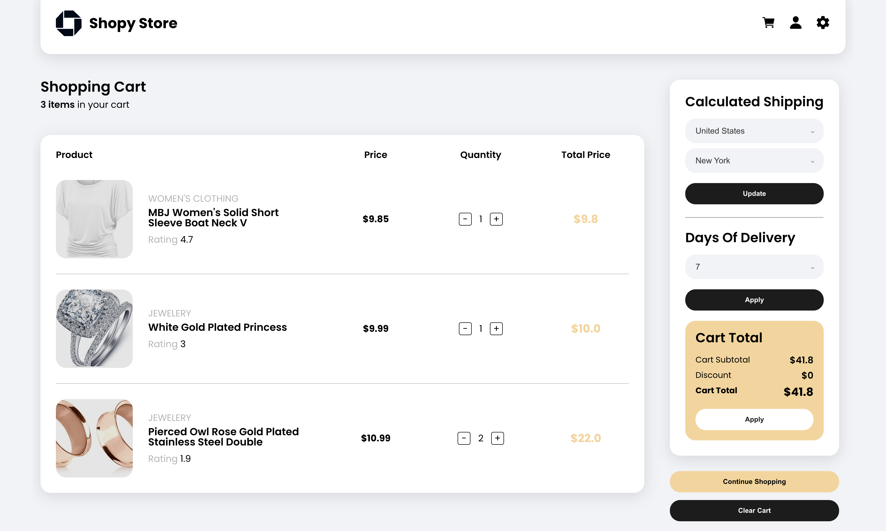
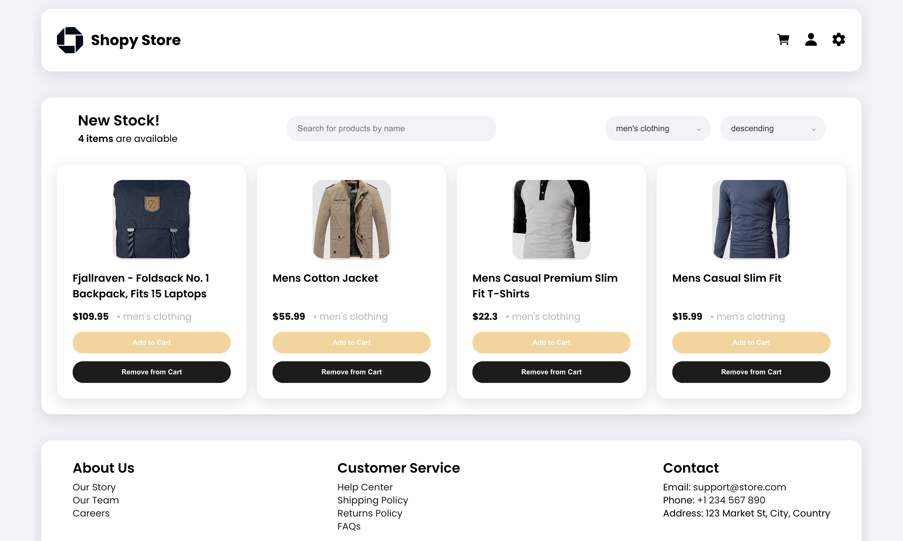
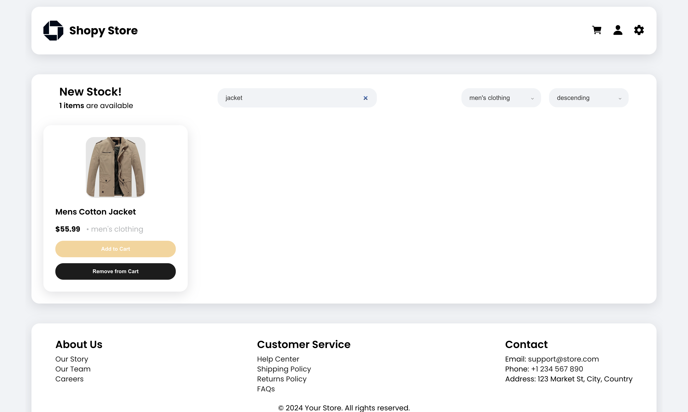
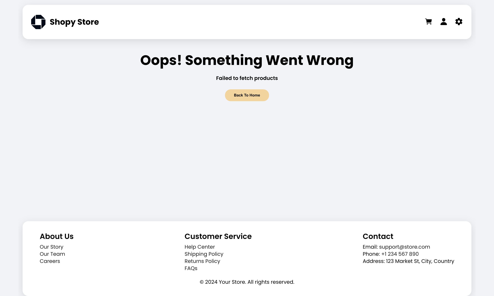
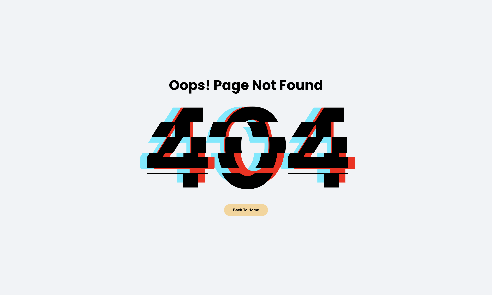

# Product Catalog App

## Description

This is a Product Catalog App where users can view products, add them to the cart, filter by category, sort by price, and use the search for the desired product. The application demonstrates the use of React.js with TypeScript for creating functional components, managing state using the Context API, and integrating with an external API (FakeStoreAPI) for dynamically retrieving product data.

## Main Features

- **Home Page** displaying a list of products, including an image, name, price, and category.
- **Cart Page** showing the products added to the cart.
  - **Add and remove products** from the cart
  - **Total cost** of all products in the cart
  - **Clear the cart**
- **Filtering, sorting, and searching products** by category and price

## Installation and Setup

### 1. Clone the repository

```bash
git clone https://github.com/geletsky/product-catalog
```

### 2. Install dependencies

Navigate to the project folder and install the dependencies:

```bash
npm install
```

### 3. Start the development server

```bash
npm run dev
```

## Project Structure

- `src/` — Source code of the application
  - `components/` — Folder containing the components
  - `context/` — Context for managing the cart state
  - `routes/` — Routes for page navigation
  - `types/` — TypeScript interfaces

## Technologies Used

- **React.js** — For building the user interface
- **TypeScript** — For static typing
- **React Router** — For page routing
- **React Context API** — For managing the cart state
- **SCSS** — For styling the interface

## Implemented Features

- The main page displays a list of products with the ability to add them to the cart.
- The cart shows the added products with the option to change their quantity and remove them.
- Product filtering by categories.
- Sorting products by price (ascending and descending).
- Product search functionality.
- Loader to indicate data loading.
- Error handling when fetching data from the API and interacting with the user, including notifications for errors.

## Screenshots

## Main Page


## Cart Page


## Filtering and Sorting


## Product Search


## Error Notification


## Error Handling


## Error Not-Found



